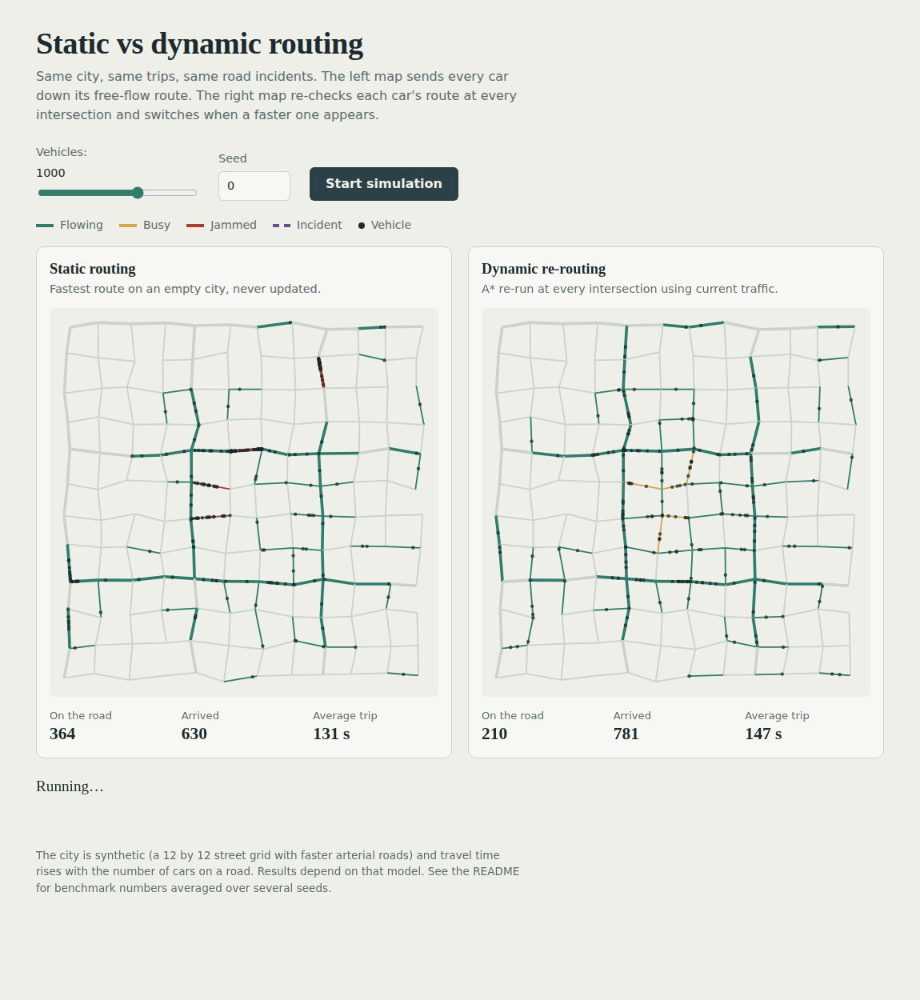
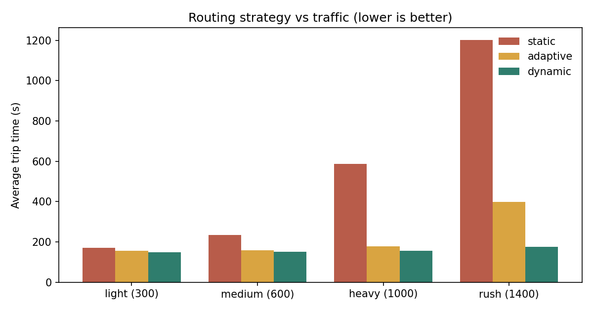

# City Traffic Network Simulator

A traffic simulator that compares **fixed routes** with **re-routing on the go**. The simulation and the shortest path algorithms (Dijkstra and A*) are written in **C++**. A small **Python (FastAPI)** server runs the C++ program and streams the simulation to a live demo in the browser using WebSockets.



## The idea

At rush hour everybody follows the same "fastest" road, that road jams up, and it stops being the fastest. So do cars get to their destination sooner if they keep checking traffic and change route on the way?

## What it does

- Builds a city with 144 intersections and 255 roads (a street grid with fast main roads and slower small streets).
- The more cars on a road, the slower it gets.
- Sends up to 1000+ cars through the city during a rush hour, most of them heading downtown, while 3 main roads get blocked by accidents.
- Runs the same cars and accidents with three routing strategies:
  - **static**: fastest route on an empty city, never changed
  - **adaptive**: fastest route using the traffic at the start, never changed
  - **dynamic**: checks again at every intersection and switches only if the new route is more than 5% faster
- Shows two strategies side by side on a live map.

## How it is built

```
Browser  <-- WebSocket -->  server.py (Python, FastAPI)  --runs-->  traffic (C++ program)
```

- `cpp/network.h`: the road graph, the congestion formula and the city builder
- `cpp/routing.h`: Dijkstra and A* with a priority queue
- `cpp/simulation.h`: the simulation loop and the three strategies
- `cpp/main.cpp`: the command line the server talks to
- `cpp/tests.cpp`: C++ tests
- `server.py`: REST API and WebSocket, starts the C++ program and passes on its output
- `benchmark.py`: runs the experiments and draws the chart
- `test_server.py`: Python tests

Travel time on a road is

```
empty_road_time * (1 + 1.5 * (cars / capacity)^3) * accident_slowdown
```

so a road is cheap when empty and gets expensive fast once it is full. Because the weights change while the simulation runs, the best route changes too.

**A\*** is Dijkstra with a guess of the time left (straight line distance divided by the fastest speed in the city). The guess is never too high, because no road is faster and traffic only adds time. So A* still finds the best route but looks at fewer intersections.

## How to run

You need `g++` (C++17) and Python 3.

```bash
pip install -r requirements-dev.txt
make                                  # builds the C++ program (creates ./traffic)
uvicorn server:app --reload           # then open http://localhost:8000
```

No `make` (for example on Windows)? Build it directly:

```bash
g++ -std=c++17 -O2 cpp/main.cpp -o traffic
```

Other commands:

```bash
make test                             # C++ tests, then Python tests
python benchmark.py                   # redo the experiments in results/
./traffic run --strategy dynamic --seed 0 --vehicles 1000    # one simulation, no server
curl "http://localhost:8000/api/route?src=0&dst=143&algo=astar"
```

## Results

Average of 10 random cities/traffic patterns (seeds). Trip time is in seconds from start to arrival.

In the 1400 car case, static routing gets completely jammed in 2 of the 10 seeds: 345 of the 14,000 cars had still not arrived when the simulation reached its 20,000 second limit. The averages only count cars that arrived, so the real static number is even worse than the table shows. Everything else (all other cases, and adaptive and dynamic everywhere) finished completely.

| Cars | Static | Adaptive | Dynamic | Dynamic vs static | Dynamic vs adaptive |
|---|---|---|---|---|---|
| light (300) | 170.3 s | 156.3 s | 150.0 s | 11.9% faster | 4.0% faster |
| medium (600) | 234.9 s | 158.7 s | 152.0 s | 35.3% faster | 4.2% faster |
| heavy (1000) | 587.7 s | 179.4 s | 157.6 s | 73.2% faster | 12.2% faster |
| rush (1400) | 1202.6 s | 399.0 s | 174.9 s | 85.5% faster | 56.2% faster |



**Dijkstra vs A\*** (300 random trips on a 900 intersection city): A* looks at about 65% fewer intersections (154 vs 441 on average) and finds the same best route.

Things to keep in mind when reading this:

- Re-routing helps more the busier the city is. With few cars it hardly matters.
- The "vs static" column is the easy comparison, because static never reacts to traffic. "vs adaptive" is the fairer one.
- Static results change a lot between seeds (for 1000 cars, from about 170 s to over 1500 s), because in some cities a few blocked roads cause a big jam. That is why I average over 10 seeds.
- The city is made up and the congestion formula is simple, so these numbers show how the strategies behave, not real savings on real roads.

## Testing

- `cpp/tests.cpp` (22 checks): Dijkstra is compared with Bellman-Ford, a different and much slower algorithm; A* must give the same cost as Dijkstra; every car must finish and leave every road it entered; the same seed must give the same result; all strategies must get the same cars; accidents must start and end.
- `test_server.py` (8 checks): the C++ routes are compared with NetworkX on random loaded roads, and the API and WebSocket are tested.
- GitHub Actions runs everything on every push.

## Limitations

- Each browser connection starts its own C++ process. That is fine for a demo but would not scale to many users.
- The city is a generated grid, not real map data.
- Cars never queue or overtake, they only slow down when a road fills up.
